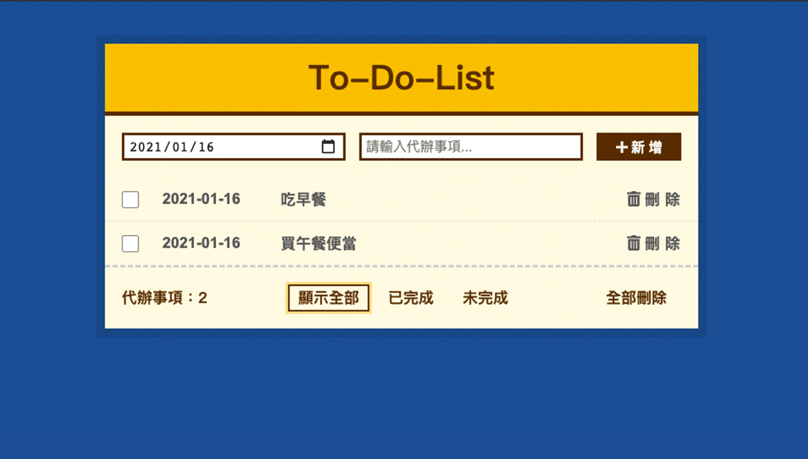

# Reac 五子棋
[DEMO](https://sage90180.github.io/react-todolist/index.html)

 

## 功能
* 新增
* 刪除
* 清空
* 編輯 (日期 / 事項)
* 標記完成/未完成
* 篩選（全部、未完成、已完成）

## 使用技術
* 以 JSX 語法撰寫元件
* 使用 styled-component 撰寫
* 使用 funciton component 及 useState 管理狀態